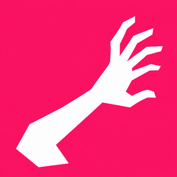
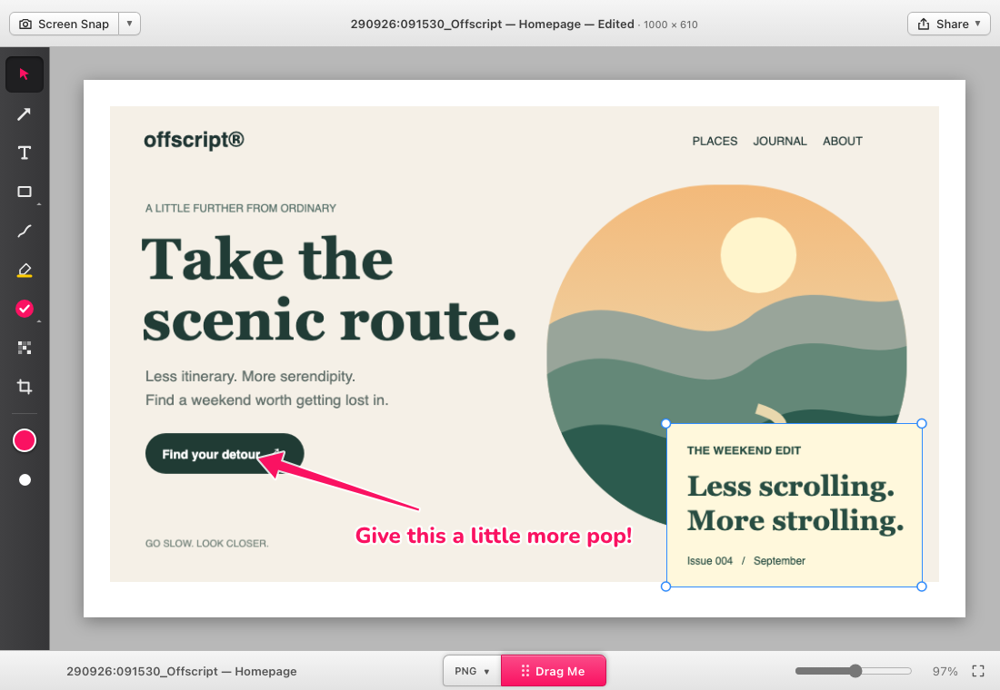

<p align="center"></p>
<h1 align="center">Skritch</h1>
<p align="center"><strong>Skritch scratches an itch.</strong><br>For the missing features you wished Skitch had.</p>
<p align="center"><a href="https://kaigani.github.io/skritch/">Website</a> · <a href="https://github.com/kaigani/skritch/releases/latest">Download for Mac</a> · <a href="https://github.com/kaigani/skritch/issues">Report a bug</a> · <a href="LICENSE">MIT license</a></p>

Skritch is a local screenshot, annotation and quick video-editing app. It pairs a compact, familiar
markup interface with multiple image layers, independent image crops, canvas cropping, editable
projects and native drag-to-save exports. Built with Tauri 2, React, TypeScript and Rust.



## Download

**[Download Skritch 0.1.0 for macOS](https://github.com/kaigani/skritch/releases/download/v0.1.0/Skritch_0.1.0_universal.dmg)**

- macOS **13.3 or later**. One universal DMG for **Apple silicon and Intel**.
- About 55 MB to download. FFmpeg and FFprobe are included; no separate installation is needed.
- Developer ID signed. **Not yet notarized**; see the first-launch instructions below.
- Free and MIT licensed. No account or cloud service required.
- The source supports Windows, but a packaged Windows release is not available yet.

[Release notes](CHANGELOG.md) · [SHA-256 checksums](https://github.com/kaigani/skritch/releases/download/v0.1.0/SHA256SUMS.txt) · [Third-party sources](https://github.com/kaigani/skritch/releases/download/v0.1.0/Skritch_0.1.0_third-party-sources.tar.gz)

## What it does

| Feature               | What you can do                                                                                                                   |
| --------------------- | --------------------------------------------------------------------------------------------------------------------------------- |
| Screen capture        | Snap a region, a window or the full display; reuse the last area; use a countdown for menus and other transient content.          |
| Annotation            | Add arrows, text, shapes, pen strokes, highlights, stamps and pixelation. Move, resize and edit them with Undo/Redo.              |
| Image layers          | Add several images to one canvas, rearrange them, and move them forward, backward, to the top or to the back.                     |
| Image and canvas crop | Crop a selected image independently, crop the entire canvas and its image layers, extend the canvas, or scale the document.       |
| Drag Me               | Choose PNG, JPG, TIFF, PDF, BMP or GIF and drag a real file directly into Finder, the Desktop or another app.                     |
| Useful filenames      | Start with the local capture timestamp and source window title. Click the footer filename to rename it.                           |
| Editable work         | Save `.skritch` image projects or `.skritchv` video projects. Smaller PNG exports also carry editable document metadata.          |
| Quick video edits     | Trim and reorder clips, step through frames, add timeline markers, export video, or open a single frame in the annotation editor. |
| Mac integration       | Native menus and shortcuts, multiple document windows, menu-bar capture, Finder Open With, Dock file drops and system printing.   |

Skritch is an independent project inspired by Skitch. It is not affiliated with Skitch or Evernote,
and does not include Evernote integration.

## Install on macOS

1. Download the DMG from this repository's [Releases](https://github.com/kaigani/skritch/releases).
2. Open it and drag **Skritch.app** into **Applications**. Quit an older copy before replacing it.
3. Launch **Skritch** from Applications, rather than running the executable inside the bundle or build folder.
4. This early release is signed but not notarized. If macOS blocks the first launch, follow Apple's
   [instructions for opening an app from an identified developer](https://support.apple.com/en-us/102445):
   open **System Settings → Privacy & Security**, review the app, and use **Open Anyway** if you choose to proceed.
5. When prompted, allow **Screen Recording** for Skritch in **System Settings → Privacy & Security**.
   Quit and reopen the app if macOS requests it.

Closing the editor window keeps Skritch available in the menu bar. Use **Skritch → Quit Skritch**
(or **⌘Q**) when an actual restart is needed.

### Screen Recording is already enabled, but capture is blocked

Older development builds were ad-hoc signed. Their identity changed between builds, which can
invalidate a Screen Recording grant while the Settings switch still appears enabled.

For the one-time move to the Developer ID build:

1. Save your work and quit every running copy of Skritch.
2. Install the new app in Applications.
3. In Screen Recording settings, remove the old Skritch entry, then add and enable
   `/Applications/Skritch.app` again.
4. Launch the installed app; quit and reopen once more if macOS asks.

New local release builds use the same Developer ID. This stabilizes the app identity across updates;
macOS still controls whether permission is granted. The app checks permission for each capture.
Repeated denied attempts show a Settings message instead of reopening the blocking explanation.

### Verify the download

Download `SHA256SUMS.txt` alongside the DMG, then compare:

```sh
shasum -a 256 Skritch_0.1.0_universal.dmg
```

You can also inspect the installed app's signature:

```sh
codesign --verify --deep --strict /Applications/Skritch.app
codesign -dv /Applications/Skritch.app 2>&1
```

The published Mac app is signed by **Developer ID Application: Kaigani Turner (3RYX74KM8T)**.

## A quick tour

### Capture and annotate

Click the main **Screen Snap** button to run the current action. Its separate arrow opens the action
picker; selecting an item changes the action without immediately capturing. The selection persists
between launches. Native **Capture** menu commands also provide previous-area and timed/menu captures.

Select a tool from the left rail, then draw on the canvas. Use **V** to select and adjust objects.
Open or drop another image and choose **Add to Canvas** to keep it alongside the existing content.

### Work with layers and crops

With multiple images, Crop starts on the selected image (or the topmost available image). Click
another image to switch targets. **Click the gray area outside the canvas to crop the canvas itself.**
The toolbar identifies whether you are cropping an **Image** or the **Canvas**.

Applying a canvas crop trims the image layers' bounds and source regions, including locked/hidden
images. Fully excluded images are removed. There are no selection handles hanging outside the new
canvas. Undo restores the canvas and layers together. Growing the canvas later does not reveal the
trimmed regions. Image crops preserve the original asset bytes within the editable document.

Use **Image → Move to Top / Move Forward / Move Backward / Move to Back** for stacking order.
Multiple selections keep their relative order. **Flip/Rotate** transforms the selected image;
with no image selected, it transforms a flattened canvas. Undo restores the previous editable layers.

### Name, save and drag

Captures default to `ddmmyy:hhmmss_Window title`, for example
`290926:091530_Offscript — Homepage`. Region captures use the window under the selection center;
unavailable titles fall back to `Screenshot`. The timestamp is fixed at capture time.

Click the filename in the footer to edit it. **Enter** or clicking away applies the change;
**Escape** cancels. Saving and dragging use the same name plus the selected format's extension.
Renaming a saved image prompts for a new save location instead of overwriting the old name.

Select an export format beside **Drag Me**, then drag the control into Finder or another app.
Each drag gets its own temporary file, so later exports do not overwrite earlier attachments.
macOS accepts a literal colon in POSIX filenames but Finder displays it as `/`; Windows and browser
drag filenames replace it with `_`.

### Keep an editable copy

- **`.skritch`** stores the image document and original assets as a project.
- **PNG** can embed editable document data when total source assets are **under 24 MiB**. Above that
  limit, reopening the PNG uses its flattened pixels. Use a project file when preserving layers matters.
- **JPG, TIFF, PDF, BMP and GIF** are flattened exports. PDF is an export format; PDF import is not implemented.
- **`.skritchv`** stores video edits and references to source media. Keep the original video files available.

### Edit a little video

Open a video, trim or reorder timeline clips, step through frames, and add markers. Send a frame to
image mode for annotation, then return to the timeline. Export through the video export dialog.
Playback uses proxies when needed; export renders from the original media. Available encoders depend
on the platform; the Mac release includes VideoToolbox and LGPL software components.

## Handy shortcuts

| Action                                    | macOS                        |
| ----------------------------------------- | ---------------------------- |
| Region capture                            | Control + Shift + 5          |
| Previous capture area                     | Control + Option + Shift + 5 |
| Timed region capture                      | Control + Shift + 6          |
| Full display capture                      | Control + Shift + 7          |
| Window capture                            | Control + Shift + 8          |
| Open / Save / Export                      | ⌘O / ⌘S / ⌘E                 |
| Undo / Redo                               | ⌘Z / ⇧⌘Z                     |
| Move forward / backward                   | ⌘] / ⌘[                      |
| Move to top / back                        | ⇧⌘] / ⇧⌘[                    |
| Select / Arrow / Text / Shape             | V / A / T / S                |
| Pen / Highlight / Stamp / Pixelate / Crop | P / H / K / B / C            |
| Apply / Cancel crop                       | Enter / Escape               |
| Fit / Actual size                         | ⌘0 / ⌘1                      |

Native menus show their shortcuts. Global capture shortcuts may conflict with other apps.

## Privacy and storage

Images and video are processed locally. There is no sign-in, analytics service or automatic upload.
Screen Recording permission is used for user-triggered captures. Captures and drag exports create
local temporary files, with cleanup policies in the native backend. **Recover Last Capture** is
available for ten minutes. The public website has no analytics or third-party scripts; GitHub hosts
its pages and download files.

## Develop

Prerequisites: **Node.js 22**, **pnpm 10**, a current **Rust stable** toolchain, and the native
[Tauri prerequisites](https://v2.tauri.app/start/prerequisites/). On macOS install Xcode Command Line
Tools. Windows requires the MSVC build tools and WebView2. FFmpeg and FFprobe must be available as
sidecars or on `PATH` for video development and native video tests.

```sh
git clone https://github.com/kaigani/skritch.git
cd skritch
pnpm install --frozen-lockfile
pnpm dev               # browser UI with mocked capture/clipboard/drag IPC
pnpm tauri dev         # real desktop app
```

The browser preview exercises the UI; it is not the native screenshot application. Browser drag
export is limited to supported browser formats, and OS capture/printing/clipboard need the desktop build.

### Build the universal Mac app

For quick local development, Homebrew FFmpeg can be staged as sidecars. Such builds may include GPL
components and are **not** the binaries used for the public release:

```sh
brew install ffmpeg
scripts/dev-ffmpeg-sidecars.sh
```

For release sidecars, build the pinned LGPL FFmpeg/FFprobe, libvpx and Opus sources:

```sh
brew install nasm pkg-config
scripts/build-ffmpeg-macos.sh
rustup target add aarch64-apple-darwin x86_64-apple-darwin
PATH="$HOME/.cargo/bin:$PATH" pnpm build:mac
```

The Rustup toolchain must precede Homebrew Rust for cross-compilation. Output is under
`apps/desktop/src-tauri/target/universal-apple-darwin/release/bundle/`.

The default local signing identity is the project's Developer ID certificate. Other developers
can set `APPLE_SIGNING_IDENTITY` to their own certificate. Setting it to `-` creates an ad-hoc development
build, whose privacy grants may not survive a rebuild. The optional CI templates explicitly use this
ad-hoc override; they are not the Developer ID release download. No signing keys are stored in this repository.

`build:mac` uses CI-mode DMG packaging to avoid Finder automation. Notarization is not configured yet.
Bundled license notices live in `apps/desktop/src-tauri/resources/licenses/`; the release includes
corresponding FFmpeg, libvpx and Opus sources plus the build script.

### Test

```sh
pnpm typecheck
pnpm lint
pnpm test
pnpm --filter @skritch/desktop exec playwright install chromium webkit
pnpm test:e2e
cd apps/desktop/src-tauri
cargo test --release --lib
```

Unit tests cover document operations, image crops, history, filenames, PNG metadata and video EDLs.
Playwright covers editor workflows with mocked IPC in Chromium and WebKit. Rust tests exercise
capture geometry, window-hide settling, image conversion and real FFmpeg video processing. Native
Finder drag/drop, OS permission migration and system print dialogs also require manual testing.
See [the QA checklist](docs/QA_CHECKLIST.md).

### Website and previews

The public site is a dependency-free static page in [`site/`](site/), published from the
`gh-pages` branch using GitHub Pages. Optional Actions workflows are in [`ci/`](ci/). Preview locally:

```sh
python3 -m http.server 4173 --directory site
```

With `pnpm dev` running, regenerate the original artwork/editor screenshots:

```sh
node apps/desktop/tests/visual/site-preview.mjs
```

Local QA screenshots in `docs/review/` are ignored; only the curated sample screenshots in
`site/assets/` are published. Update versioned release links in the site and README when publishing
another release. Upload the DMG, checksum file and corresponding third-party source archive together.
After committing website changes, publish them with `git subtree push --prefix site origin gh-pages`.

## Project layout

```text
apps/desktop/src/             React + TypeScript application
  model/                      document model, commands, history and video EDL
  canvas/                     layered Canvas2D renderer and annotation tools
  export/                     formats, editable PNG metadata and project serialization
  video/                      player, timeline and video export UI
  ipc/                        typed native bridge and browser mock
apps/desktop/src-tauri/       Rust capture, native menus, clipboard, tray and FFmpeg pipeline
scripts/                     sidecar builds and license-notice collection
site/                        public GitHub Pages download site
docs/                        IPC reference and QA checklist
```

## Contributing and support

Bug reports and focused pull requests are welcome. Include your OS version, app version, reproduction
steps and expected behavior. Remove private information from logs and screenshots. Run the relevant
checks above before opening a PR. Keep platform-specific integration behind the native bridge, preserve
Undo/Redo for document changes, and keep the screenshot workflow compact.

This is an early public release. Current limits include no notarization, no packaged Windows download,
no PDF import, and no cloud sync. The implementation history is in [DECISIONS.md](DECISIONS.md); older
entries describe earlier milestones and may be superseded by the current README.

## License and acknowledgments

Skritch is **[MIT licensed](LICENSE)**, copyright © 2026 Kaigani Turner. Third-party software retains
its own licenses; see [THIRD_PARTY.md](THIRD_PARTY.md) and the bundled notices. The app uses code from
[FFmpeg](https://ffmpeg.org/) under LGPL-2.1-or-later; its corresponding source is included in the
[release source archive](https://github.com/kaigani/skritch/releases/download/v0.1.0/Skritch_0.1.0_third-party-sources.tar.gz).

With appreciation for the simple, useful spirit of Skitch. Skitch and Evernote are trademarks of
their respective owners; this project is independent.
